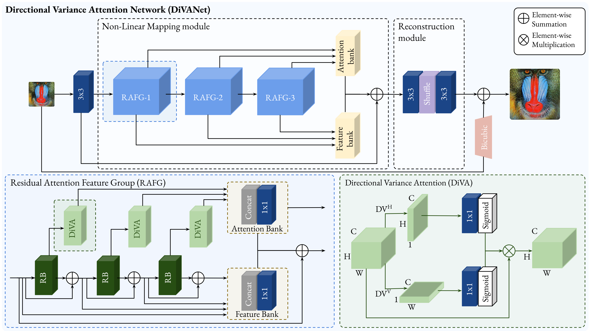
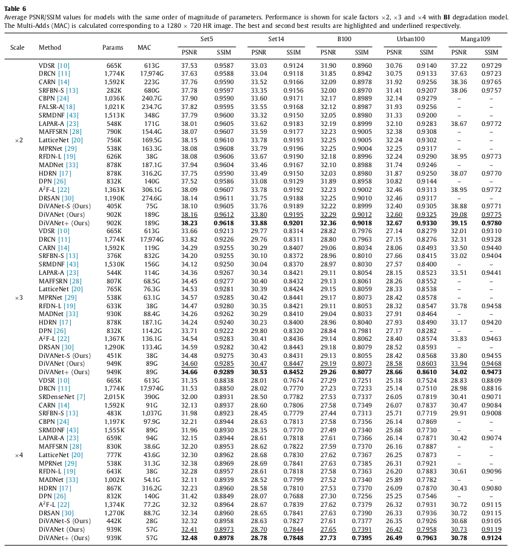
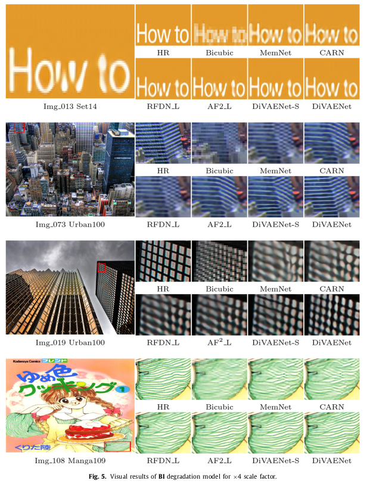
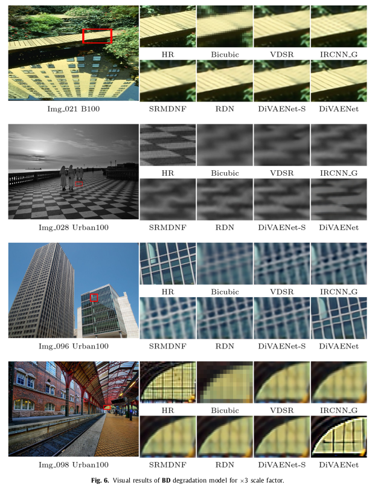
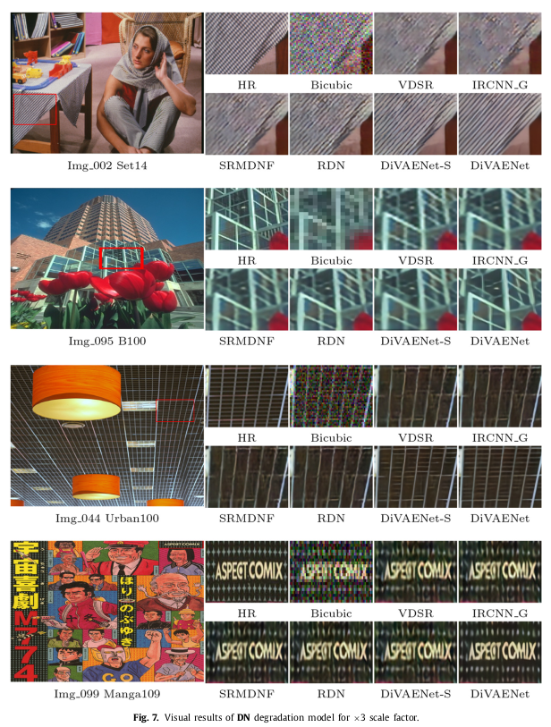

# DiVANet-PyTorch
### This is repository is an official PyTorch implementation of the paper "Single image super-resolution based on directional variance attention network".
Pattern Recognition, 2022. [[Paper](https://www.sciencedirect.com/science/article/pii/S0031320322004770?dgcid=author)] 

### Abstract 
Recent advances in single image super-resolution (SISR) explore the power of deep convolutional neural networks (CNNs) to achieve better performance. However, most of the progress has been made by scaling CNN architectures, which usually raise computational demands and memory consumption. This
makes modern architectures less applicable in practice. In addition, most CNN-based SR methods do not fully utilize the informative hierarchical features that are helpful for final image recovery. In order to address these issues, we propose a directional variance attention network (DiVANet), a computationally efficient yet accurate network for SISR. Specifically, we introduce a novel directional variance attention (DiVA) mechanism to capture long-range spatial dependencies and exploit inter-channel dependencies simultaneously for more discriminative representations. Furthermore, we propose a residual attention feature group (RAFG) for parallelizing attention and residual block computation. The output of each residual block is linearly fused at the RAFG output to provide access to the whole feature hierarchy. In parallel, DiVA extracts most relevant features from the network for improving the final output and preventing information loss along the successive operations inside the network. Experimental results demonstrate the superiority of DiVANet over the state of the art in several datasets, while maintaining relatively low computation and memory footprint.



### Requirements
- Python 3
- [PyTorch](https://github.com/pytorch/pytorch) (0.4.0), [torchvision](https://github.com/pytorch/vision)
- Numpy, Scipy
- Pillow, Scikit-image
- h5py
- importlib

#### Contents
1. [Dataset](#Dataset)
1. [Testing](#Testing)
1. [Training](#Training)
1. [Results](#Results)
1. [Citetion](#Citetion)


### Dataset
We use DIV2K dataset for training and Set5, Set14, B100, and Urban100 dataset for the benchmark test. Here are the following steps to prepare datasets.

1. Download [DIV2K](https://data.vision.ee.ethz.ch/cvl/DIV2K) and unzip on `dataset` directory as below:
  ```
  dataset
  └── DIV2K
      ├── DIV2K_train_HR
      ├── DIV2K_train_LR_bicubic
      ├── DIV2K_valid_HR
      └── DIV2K_valid_LR_bicubic
  ```
2. To accelerate training, we first convert training images to h5 format as follow (h5py module has to be installed).
```shell
$ python div2h5.py
```
3. Other benchmark datasets can be downloaded in [Google Drive](https://drive.google.com/drive/folders/1t2le0-Wz7GZQ4M2mJqmRamw5o4ce2AVw?usp=sharing). Same as DIV2K, please put all the datasets in `dataset` directory.

### Testing
We provide the pretrained models in `checkpoint` directory. To test DiVANet on benchmark dataset:
```shell
# Scale factor x2
$ python sample.py      --test_data_dir dataset/<dataset> --scale 2 --ckpt_path ./checkpoints/<path>.pth --sample_dir <sample_dir>

# Scale factor x3                
$ python sample.py      --test_data_dir dataset/<dataset> --scale 3 --ckpt_path ./checkpoints/<path>.pth --sample_dir <sample_dir>

# Scale factor x4
$ python sample.py      --test_data_dir dataset/<dataset> --scale 4 --ckpt_path ./checkpoints/<path>.pth --sample_dir <sample_dir>
```

### Training
Here are our settings to train DiVANet. Note: We use two GPU to utilize large batch size, but if OOM error arise, please reduce batch size.
```shell
# Scale factor x2
$ python train.py --patch_size 64 --batch_size 64 --max_steps 600000 --lr 0.001 --decay 150000 --scale 2  --upscale 3

# Scale factor x3
$ python train.py --patch_size 64 --batch_size 64 --max_steps 600000 --lr 0.001 --decay 150000 --scale 3  --upscale 4

# Scale factor x4
$ python train.py --patch_size 64 --batch_size 64 --max_steps 600000 --lr 0.001 --decay 150000 --scale 4  --upscale 5               
                      
 ```
 ### Results
We achieved state-of-the-art performance on lightweigh image SR, denoising and deblurring. All visual results of DiVANet (BI, BD, and DN) for scale factor x2, x3, and x4 can be downloaded [here.](https://drive.google.com/drive/folders/1f6APmamiP4EUrm4oGoJ1NVDYZjwELogX?usp=sharing)

<details>
<summary>Lightweight Single Image Super-Resolution (click me)</summary>
<p align="center">
  
  
</p>
  </details>


<details>
<summary>Image denoising and deblurring (click me)</summary>
<p align="center">
  
  
</p>
  </details>

## Citation
```
@article{behjati2023single,
  title={Single image super-resolution based on directional variance attention network},
  author={Behjati, Parichehr and Rodriguez, Pau and Fern{\'a}ndez, Carles and Hupont, Isabelle and Mehri, Armin and Gonz{\`a}lez, Jordi},
  journal={Pattern Recognition},
  volume={133},
  pages={108997},
  year={2023},
  publisher={Elsevier}
}
```
This implementation is for non-commercial research use only. If you find this code useful in your research, please cite the above paper. Please also see our other works:

- Frequency-Based Enhancement Network for Efficient Super-Resolution - IEEE ACCESS, 2022 - [[Paper](https://ieeexplore.ieee.org/document/9778017)] 
[[Code](https://github.com/pbehjatii/FENet)] 

- OverNet: Lightweight Multi-Scale Super-Resolution with Overscaling Network - WACV, 2022- [[Paper](https://openaccess.thecvf.com/content/WACV2021/papers/Behjati_OverNet_Lightweight_Multi-Scale_Super-Resolution_With_Overscaling_Network_WACV_2021_paper.pdf)] 
[[Code](https://github.com/pbehjatii/OverNet-PyTorch)] 

- Hierarchical Residual Attention Network for Single Image Super-Resolution [[arXiv](https://arxiv.org/abs/2012.04578)]
